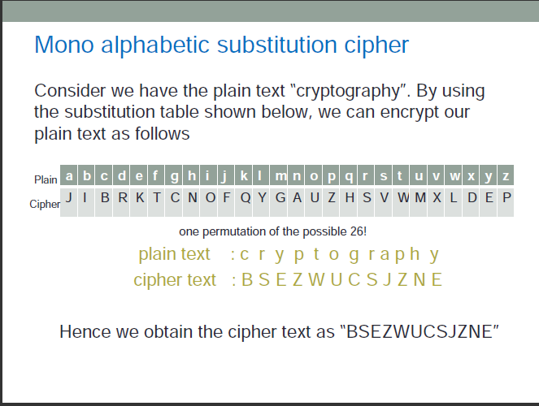

Consider we have the plain text "cryptography".
By using the substitution table below, we can encrypt our plain text as follows:
abc def gh i j k l mno pqr s t u vwx yz

JI BRKTCNOFQYG AUZHSVWMXL DEP

plain text: c r y p t o g r a p h y

cipher text: B S E Z W U C S J Z N E

Hence we obtain the cipher text as "BSEZWUCSJZNE".

**Cryptanalysis**

Note that the frequency of occurrence of characters in the plaintext is "preserved" in the ciphertext. For instance, the most frequent character in the ciphertext is likely to be the encryption of the plaintext character "e" which is the most frequently occurring charecter in English. For a very brief theory of the mono-alphabetic substitution cipher and its cryptanalysis, click [here](docs/monoalphacipher.pdf)

