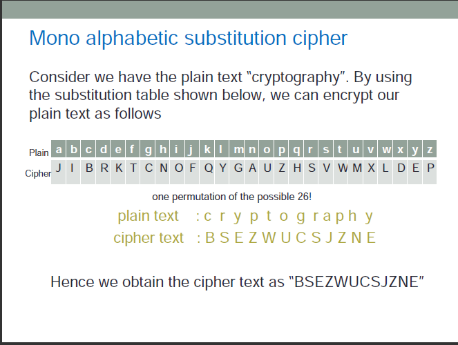

For a very brief theory of mono-alphabetic substitution ciphers and their cryptanalysis, click [here](docs/monoalphacipher.pdf)

The mono-alphabetic substitution cipher is one of the classical encryption techniques where each letter in the plaintext is replaced by a corresponding letter from a fixed substitution alphabet. Unlike the shift cipher which uses a simple offset, substitution ciphers use a complete permutation of the alphabet, making them more complex but still vulnerable to cryptanalytic attacks.

### How It Works

1. **Key Space**: The key is a permutation of the alphabet (26! possible keys for English)
2. **Encryption**: Each plaintext letter is replaced by its corresponding cipher letter
   - Example: If a→J, b→I, c→B, then "cab" becomes "BJI"
3. **Decryption**: Each cipher letter is replaced back with its corresponding plaintext letter
   - Example: "BJI" becomes "cab" using the reverse mapping

### Mathematical Representation

Consider we have the plaintext "cryptography".
By using the substitution table below, we can encrypt our plaintext as follows:

```
Plain:  a b c d e f g h i j k l m n o p q r s t u v w x y z
Cipher: J I B R K T C N O F Q Y G A U Z H S V W M X L D E P
```

**Encryption Process:**

- plaintext: c r y p t o g r a p h y
- ciphertext: B S E Z W U C S J Z N E

Hence we obtain the ciphertext as **"BSEZWUCSJZNE"**.

### Security Analysis

The mono-alphabetic substitution cipher has several characteristics:

1. **Large Key Space**: 26! ≈ 4 × 10²⁶ possible keys (much larger than shift cipher)
2. **Frequency Preservation**: Letter frequencies are preserved in the ciphertext
3. **Vulnerable to Statistical Analysis**: Can be broken using frequency analysis
4. **Pattern Preservation**: Letter patterns and relationships are maintained

### Cryptanalysis Techniques

**Note:** The frequency of occurrence of characters in the plaintext is "preserved" in the ciphertext. For instance, the most frequent character in the ciphertext is likely to be the encryption of the plaintext character "e" which is the most frequently occurring character in English.

The substitution cipher can be broken using:

1. **Frequency Analysis**:

   - Compare letter frequencies with standard English
   - Most frequent ciphertext letter likely maps to 'e'
   - Second most frequent likely maps to 't' or 'a'

2. **Pattern Analysis**:

   - Look for common English patterns (th, er, on, an, etc.)
   - Identify repeated letter sequences
   - Analyze word structure and length

3. **Contextual Analysis**:

   - Use partial decryption to guess remaining letters
   - Look for common short words (a, an, the, and, etc.)
   - Apply linguistic knowledge and context clues

4. **Dictionary Attack**:
   - Try common words and phrases
   - Use known plaintext attacks if available

### Breaking the Cipher

Unlike the shift cipher with only 25 possible keys, the substitution cipher requires more sophisticated analysis:

1. **Statistical Attack**: Use frequency analysis as the primary method
2. **Hill Climbing**: Gradually improve substitutions based on language patterns
3. **Genetic Algorithms**: Use computational methods for automated cryptanalysis

### English Letter Frequencies

Standard frequencies used in cryptanalysis:

- E: 12.70%, T: 9.06%, A: 8.17%, O: 7.51%, I: 6.97%
- N: 6.75%, S: 6.33%, H: 6.09%, R: 5.99%, D: 4.25%



### Historical Context

Mono-alphabetic substitution ciphers were widely used throughout history but became vulnerable once frequency analysis was developed. Modern cryptographic systems use polyalphabetic substitutions, block ciphers, and other advanced techniques to prevent statistical attacks.
